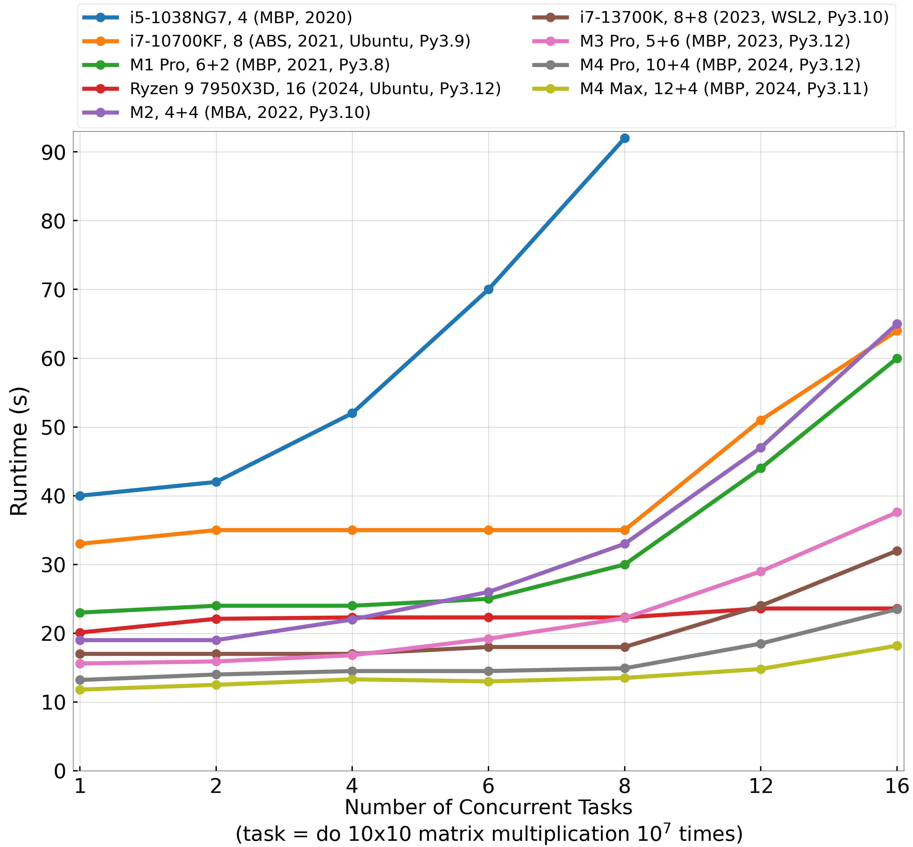

# Introduction: CPU Performance Benchmark
It is interesting to see how the CPU advanced throughout the years. This repository is a simple performance benchmark, derived from my workflow that heavily uses Python3 and Numpy. 
Unlike other benchmarks, my benchmark's performance metric **has actual meanings**. The metric is the **runtime (in seconds) of completing some number of tasks concurrently**, and each task is fixed -- repeating $10\times10$ matrix multiplication $10^7$ times.

# How to Run the Benchmark
Stress a CPU by small matrix multiplication. I observe that **small matrix multiplication in Numpy only uses a single core**. To start the benchmark, please run the following in the terminal:
```
python stress.py -t 1 2 4 6 8 12 16
```
`-t` is short for `--tasks`, denoting the number of tasks running concurrently. Also, remember to run the `htop` command to observe the stressing process.

# How Software Impacts the CPU Performance Benchmark
- *Operating System*. Linux is apparently faster than Windows (Windows performance is also strange, and varies a lot across different power modes). 
Microsoft smartly put Linux inside Windows and created Windows Subsystems for Linux (WSL). 
The WSL 2 is faster than Windows. MacOS performance should be similar to Linux.

- *Python version*. [Python 3.11](https://github.com/caitaozhan/stress/blob/8a399b5a8d62d5beee7fbc3dcf75bed97d2c805b/results#L214) is around *14% faster* than [Python 3.8](https://github.com/caitaozhan/stress/blob/8a399b5a8d62d5beee7fbc3dcf75bed97d2c805b/results#L203) based on my benchmark running on my Macbook Pro (2021).
The difference is larger than I expected, since my benchmark's bottleneck is running numpy.dot(), which is implemented in C/C++. I think both C/C++ speed and matrix multiplication algorithm can barely improve. 
When newer Python versions come out, I do not rerun the old results because very often the results are run on other people's computers, so it is inconvenient to rerun. 

# Results



**Evaluation**
1. Intel has finally significantly improved in recent years. The 13th gen (purple line) desktop CPU is a lot faster than the 10th gen (orange line).
2. M1 Pro is a laptop CPU (green line), but it beats the high-end desktop Intel CPU (orange line), not to mention the laptop 10th-gen Intel CPU (blue line). 
3. M2 in MacBook Air (red line) is faster than M1 Pro (green line) when the number of tasks is 4 or under, but is slower when the number of tasks is larger than 4. This is because the M1 Pro has 6 performance cores and 2 efficiency cores while the M2 has 4 performance cores and 4 efficiency cores.


**More**: The complete raw data is [here](results). The oldest data point is from a MacBook Pro (Retina, 15-inch, Mid 2012).
